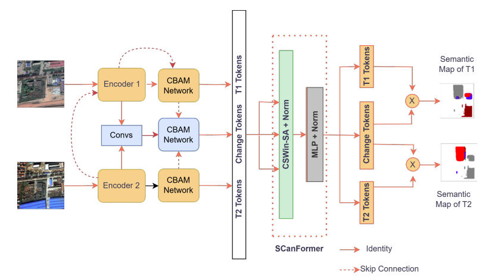
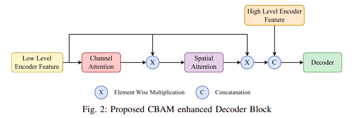
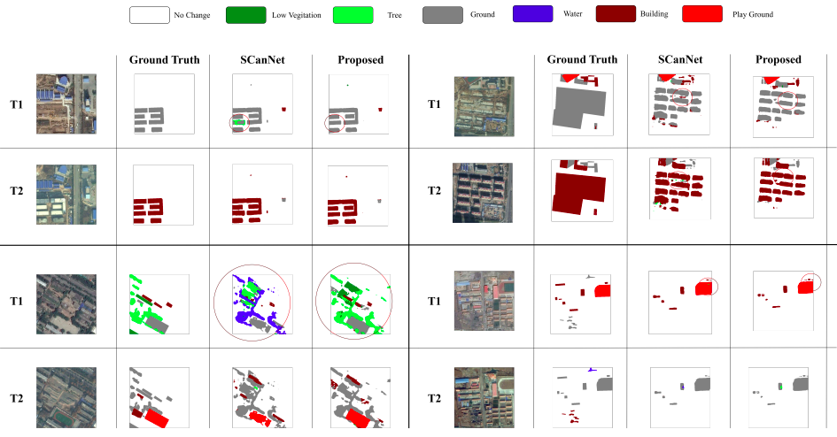

# Enhanced SCanNet: CBAM and Dice Loss for Semantic Change Detection
  [](LICENSE)

This repository contains the PyTorch implementation of **Enhanced SCanNet**, a semantic change detection (SCD) framework for multi‑temporal remote sensing images. The method improves the original **SCanNet** by integrating **CBAM-based attention** into the decoder and incorporating **Dice Loss** to better handle class imbalance.

This work is based on the paper:

> **Enhanced SCanNet with CBAM and Dice Loss for Semantic Change Detection**  
> R.M.A.M.B. Ratnayake *et al.*, University of Peradeniya  
> DOI: [https://doi.org/10.1109/MERCon67903.2025.11217111](https://doi.org/10.1109/MERCon67903.2025.11217111)
---

## 🔍 Overview

Semantic Change Detection aims to identify *what has changed* and *how land‑cover semantics evolve* between two temporal images. While recent architectures such as SCanNet achieve strong performance, challenges remain due to noise, subtle boundaries, and class imbalance.

**Enhanced SCanNet** addresses these challenges by:

* Introducing **Convolutional Block Attention Modules (CBAM)** in the decoder to refine spatial and channel-wise features
* Using **Dice Loss** alongside standard losses to improve sensitivity to minority change classes

The proposed enhancements lead to consistent improvements on the **SECOND dataset**.

---

## 🧠 Method Summary

* Backbone: **SCanNet** (Triple Encoder–Decoder with cross‑temporal attention)
* Enhancement 1: **CBAM‑enhanced decoder blocks** for attention‑guided feature fusion
* Enhancement 2: **Dice Loss** to mitigate severe class imbalance in change regions
* Training retains SCanNet’s semantic consistency and pseudo‑label supervision

---

## 🖼️ Architecture

### Overall Architecture



### CBAM‑Enhanced Decoder Block



---

## 🔗 Pretrained Models
### Baseline SCanNet (for comparison)

The original SCanNet pretrained models provided by the authors can be used for baseline evaluation:

* **SCanNet (SECOND Dataset):**
  [https://github.com/ggsDing/SCanNet](https://github.com/ggsDing/SCanNet)

* **SCanNet (LandsatSCD Dataset):**
  [https://github.com/ggsDing/SCanNet](https://github.com/ggsDing/SCanNet)

> Refer to the official SCanNet repository for checkpoint download links and usage instructions.

---

## 📊 Dataset

Experiments are conducted on the **SECOND dataset**, which contains:

* 4,662 bi‑temporal image pairs (512 × 512)
* 6 land‑cover classes
* Urban‑focused semantic change annotations

Dataset split:

* **Training:** 3,729 image pairs
* **Testing:** 933 image pairs

---

## ⚙️ Training Details

* Framework: **PyTorch**
* Backbone: **ResNet‑34 (ImageNet pretrained)**
* Optimizer: **SGD with Nesterov momentum**
* Batch size: **6**
* Learning rate: **0.1** with polynomial decay

---

## 📈 Results

### Quantitative Results (SECOND Dataset)

| Method                          | OA (%)    | Fscd (%)  | mIoU (%)  | SeK (%)   |
| ------------------------------- | --------- | --------- | --------- | --------- |
| SCanNet                         | 87.86     | 63.66     | 73.42     | 23.94     |
| **Enhanced SCanNet (Proposed)** | **88.12** | **64.31** | **73.63** | **24.25** |

---

## 🖼️ Qualitative Results


The proposed model produces sharper boundaries, fewer false positives, and improved recovery of small change regions compared to the baseline.

---

## 📌 Citation

If you find this work useful, please cite:

```bibtex
@INPROCEEDINGS{11217111,
  author={Ratnayake, R.M.A.M.B. and Wijenayake, W.M.B.S.K. and Sumanasekara, D.M.U.P. and Godaliyadda, G.M.R.I. and Herath, H.M.V.R. and Ekanayake, M.P.B.},
  booktitle={2025 Moratuwa Engineering Research Conference (MERCon)}, 
  title={Enhanced SCanNet with CBAM and Dice Loss for Semantic Change Detection}, 
  year={2025},
  volume={},
  number={},
  pages={84-89},
  keywords={Training;Accuracy;Attention mechanisms;Sensitivity;Semantics;Refining;Feature extraction;Transformers;Power capacitors;Remote sensing},
  doi={10.1109/MERCon67903.2025.11217111}}

```

---

## 🙏 Acknowledgements

* Original **SCanNet** by Ding *et al.*
* **CBAM** by Woo *et al.*
* **SECOND dataset** by Shi *et al.*

---
